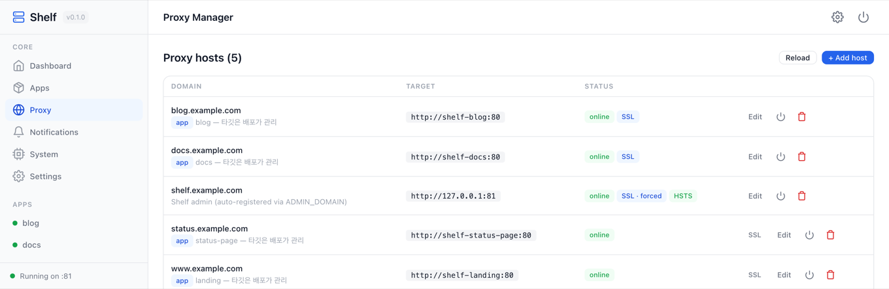
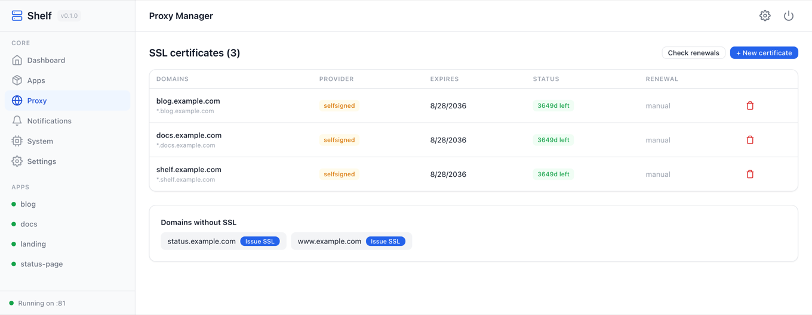
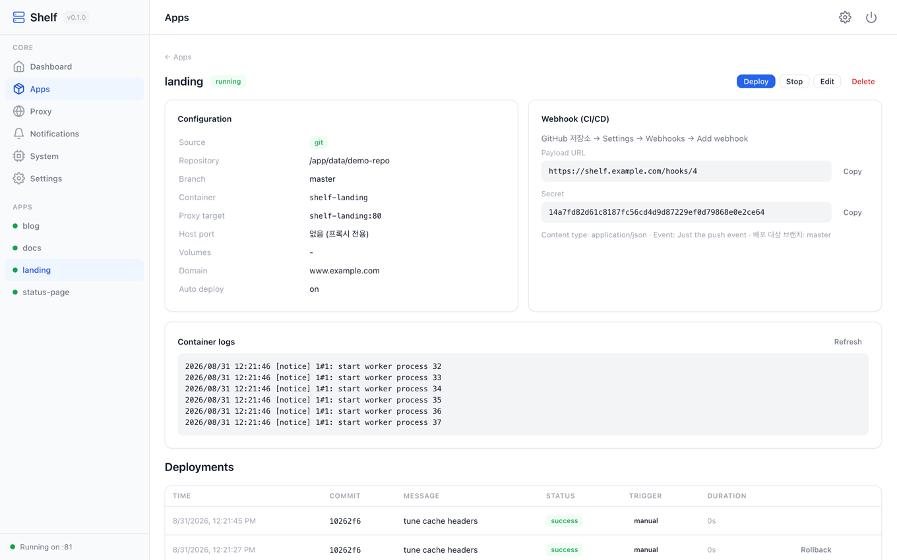
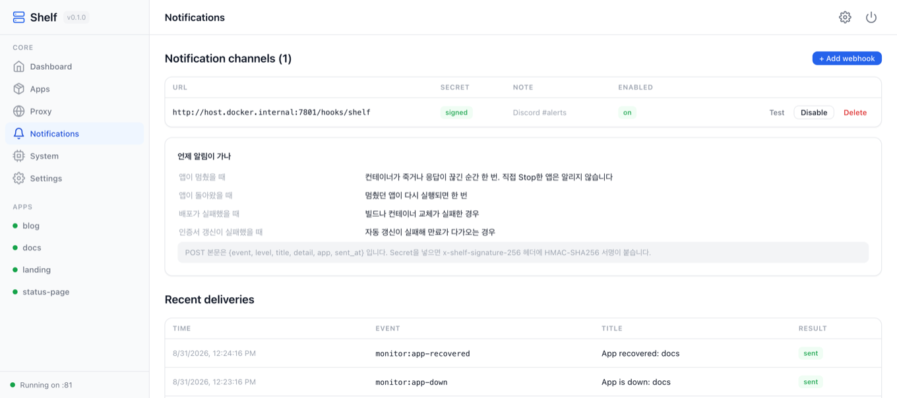
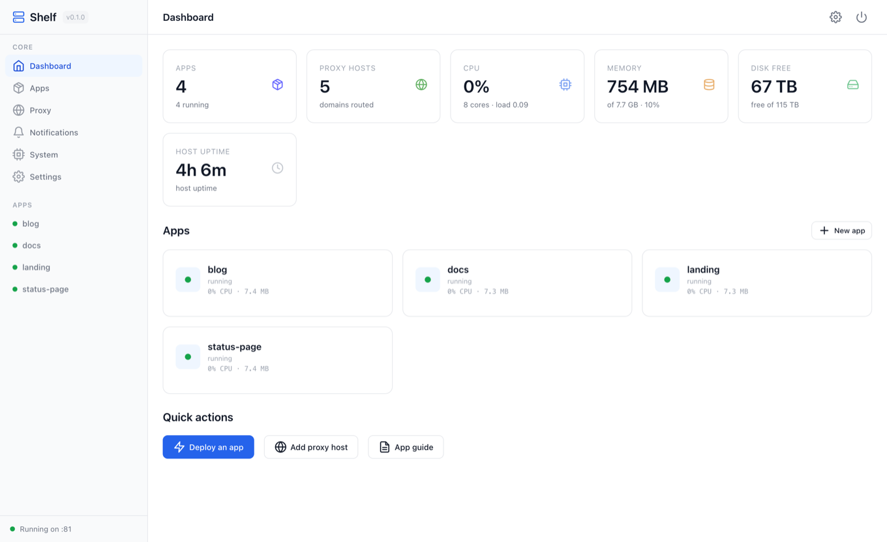

# Shelf

> Built to make one server's reverse proxy pleasant to live with.

[한국어](README.md) · [Landing page](https://kangminna.github.io/shelf/) · MIT

Editing an nginx config to point one more domain somewhere, wiring a certbot cron, keeping a spreadsheet of which
port is taken — that's the chore this exists to remove. Shelf is a **reverse proxy that owns 80/443** and lets you
manage domains, certificates and upstreams from a screen.

App deployment sits on top of that. The proxy has to know about your containers anyway, so it may as well start them too.

---

## The proxy



Type a domain, choose where it goes. That's the whole interaction.

- **Routed by container name** — apps and the proxy share a Docker network, so traffic goes straight to `shelf-blog:80`.
  No host ports to publish, no port numbers to remember.
- **Let's Encrypt** — HTTP-01 or Cloudflare DNS-01, wildcards included, renewal checked daily.
- **HTTPS enforced on arrival** — once a domain has a certificate, port 80 redirects and HSTS turns on.
  Remove the certificate and it reverts, so you can't lock yourself out of your own server.
- **WebSockets pass through** — after the upgrade, bytes are piped without interpretation.
- **Access logs** — status and duration per domain, kept 14 days by default, pruned automatically.
- **Only 80 and 443 face the world** — the admin UI sits behind the proxy too.



---

## Deploying apps



There is one contract: **a `Dockerfile` at the repo root, and a container that serves HTTP on a single port.**
Language, framework and database are entirely the app's business.

- **Git or image** — clone and `docker build`, or pull a published image from Docker Hub or GHCR.
- **Push to deploy** — Shelf generates the webhook URL and secret; paste them into GitHub. Payloads are HMAC-verified.
- **History and rollback** — every commit, timestamp, result and full build log is kept; rebuild from an earlier commit.
- **Domains register themselves** — give an app a domain and the proxy entry appears with it, and disappears when the app is deleted.

---

## Watching and alerts



- **Host and app metrics** — CPU, load, memory, free disk, plus per-app CPU and memory. Sampled in the background, so pages never wait on Docker.
- **Alerts on change, not on a timer** — one when an app goes down, one when it comes back. An app you stopped on purpose is never an incident.
- **Delivered by webhook** — JSON over POST; a Discord or Slack incoming webhook URL works as is.
  Add a secret and the body is signed with HMAC-SHA256 in `x-shelf-signature-256`. Every delivery is recorded.



---

## Install

Two commands on any Linux box with Docker.

```bash
git clone https://github.com/KangminNa/shelf && cd shelf
docker compose up -d --build
```

The admin UI asks you to create an account on first visit. Put a domain in `.env` and it is routed at boot:

```bash
ADMIN_DOMAIN=shelf.example.com
ACME_EMAIL=you@example.com
```

For development:

```bash
npm install
npm run dev          # http://localhost:9666/admin
npm test             # 96 tests
```

Forgot the password? From a shell on the server:

```bash
docker compose exec shelf npm run admin passwd admin 'new-password'
docker compose exec shelf npm run admin reset     # wipe accounts, reopen /setup
```

---

## Your first app

1. **Apps → New app** — a Git URL (the repo needs a `Dockerfile`) or a Docker image name, the container port, optionally a domain.
2. **Deploy** — clone → build → run (`shelf-{name}`, `--restart unless-stopped`).
3. **Webhook** — copy the Payload URL and Secret from the app page into GitHub → Settings → Webhooks. Every push redeploys.
4. **SSL** — issue a certificate for the domain from Proxy → SSL and it switches to https.

A minimal example lives in [`examples/hello-app/`](examples/hello-app/).

---

## Landing page

[kangminna.github.io/shelf](https://kangminna.github.io/shelf/) — this repository's `site/` folder, published to GitHub Pages.

`site/index.html` is a **single file** with the screenshots embedded as data URIs, so it opens anywhere.
After retaking screenshots:

```bash
python3 site/build.py <screenshot directory>   # template.html + screenshots → index.html
```

---

## Change it however you like

It's MIT. Fork it, rewrite it, lift the parts you need, turn it into an internal tool.
The project is built on the assumption that you will adjust it to your own server.

Things kept deliberately simple so that stays easy:

- **Four runtime dependencies** — `hono`, `@hono/node-server`, `better-sqlite3`, `acme-client`. No build step, no frontend framework.
- **HTML is rendered on the server** — no React, no bundler. A screen is one class in `views.ts`, and all browser behaviour lives in `ui/runtime.ts`.
- **Raw SQL only in `db/`** — domain code uses `Repository<T>`.
- **Systems never import each other** — auth, deploy, proxy and notify talk over an EventBus.
- **The docs are enforced** — [OBJECTS.md](docs/OBJECTS.md) holds one responsibility sentence per class, and `npm test` fails when a class exists without one.

Reading order: [SPEC](docs/SPEC.md) what it provides · [OBJECTS](docs/OBJECTS.md) who does what ·
[ARCHITECTURE](docs/ARCHITECTURE.md) the shape · [PROCESS](docs/PROCESS.md) how features get built ·
[HISTORY](docs/HISTORY.md) why it looks like this · [DEVELOPMENT](docs/DEVELOPMENT.md) a class-level walkthrough.
(The docs are in Korean.)

```
core/src/
├── kernel/          ShelfApplication — boot & routing · Controller — response contract
├── system/
│   ├── proxy/       proxy server (SNI/ACME), certificate issuers, controller
│   ├── deploy/      app repositories, build pipeline, containers, webhooks, watcher
│   ├── notify/      alert channels and delivery history
│   └── auth/        sessions and accounts
├── db/              AppDatabase → Repository<T> → QueryBuilder<T>
├── services/        EventBus · Logger · Scheduler · HostMetrics
├── ui/              element builder · pages · client runtime
└── admin/           dashboard, system and settings pages
```

---

## Running it in the open

- Shelf mounts `/var/run/docker.sock`, which is full control of the host's Docker daemon — so the **admin account is
  root-equivalent by design**. Run it on machines you own, and hand out admin credentials only to people you'd trust with the server.
- Deploying an app runs someone else's code on your machine. Only deploy repositories you trust.
- Secrets (git tokens, webhook secrets, DNS tokens) are stored under `data/`. Protect that directory — permissions, disk encryption, careful backups.
- Recommended deployment: expose **only 80/443**. Set `ADMIN_DOMAIN` so the admin UI is served through the proxy over SSL;
  compose already binds the admin UI (81) and webhooks (9100) to 127.0.0.1 so they never leave the proxy.
- What's built in: scrypt session auth, login lockout after 5 failures for 15 minutes, Secure/httpOnly/SameSite cookies,
  HMAC-verified webhooks with body size limits, no CORS, validation on git and image references, secrets stripped from API responses and masked in logs.

---

## License

MIT © Kangmin Na
